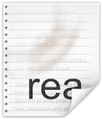

# mohansahstudios.github.io
## studio site map

```
mohansahstudios.github.io/ (Repository Root)
│
├── app-ads.txt					<-- MUST be at the root for Ad Networks to find it
├── sellers.json				<-- Advanced ad transparency file (often used with app-ads)
│
├── index.html                  <-- Your actual Studio Homepage (Marketing, Games list)
│
├── assets/                     <-- Centralized branding
│   ├── css/legal-style.css     <-- One CSS file styles ALL legal pages
│   └── images/studio-logo.png
│
└── legal/                      <-- All compliance documents live here
    │
    ├── en/                     <-- English (Default Language)
    │   ├── privacy.html        <-- Unified Studio Privacy Policy
    │   ├── terms.html          <-- Unified Terms of Service
    │   ├── cookies.html        <-- Cookie Policy
    │   │
    │   ├── games/              <-- Game-Specific Overrides
    │   │   ├── handcricket/
    │   │   │   ├── privacy.html  <-- Used only if HandCricket needs special rules
    │   │   │   └── eula.html     <-- End User License Agreement
    │   │   │
    │   │   └── wordlequest/
    │   │       └── privacy.html
    │   │
    │   └── archive/            <-- Crucial for legal protection
    │       ├── privacy-v1-2025.html
    │       └── terms-v1-2025.html
    │
    ├── es/                     <-- Spanish Translations
    │   ├── privacy.html
    │   └── terms.html
    │
    └── fr/                     <-- French Translations
        ├── privacy.html
        └── terms.html
```

## Contact mail roles:

- **For general inquiries: mohansahstudios@gmail.com** 

-  **For your unified privacy policy: mohansahstudios+legal@gmail.com** 

-  **For general support: mohansahstudios+support@gmail.com** 

-  **For specific games:** 
    - Handcricket : **mohansahstudios+handcricket@gmail.com** 

    - Wordlequestn: **mohansahstudios+wordlequest@gmail.com** 

Gmail has a built-in feature called "Plus Aliasing."
Gmail completely ignores the plus sign (+) and any words that come after it. Everything just drops into your main inbox.


Setting up Labels keep everything under one account.


## Formatting Refference 
- ### Awesome README [](https://github.com/sindresorhus/awesome#readme)
> A curated list of awesome READMEs
> 
--> **[LINK!](https://github.com/matiassingers/awesome-readme?tab=readme-ov-file)**
